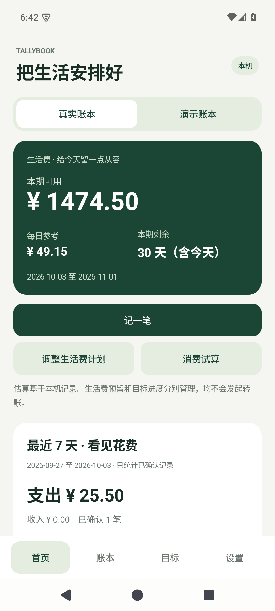
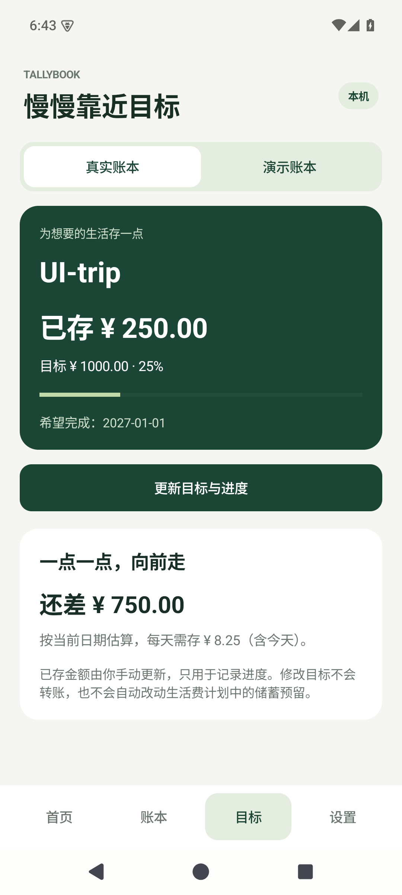

# 小账本 Tallybook

面向大学生日常生活费与存钱目标的本地 Android 应用。当前版本：**0.3.1 原型**。

设置一个生活费周期，记下日常收支，查看剩余可用金额与存钱进度。全部数据保存在本机，应用没有联网权限。

 

以上为模拟器中的虚构测试数据。

## 在电脑上预览

Windows 中双击项目根目录的 **`预览小账本.cmd`**，即可打开安卓模拟器并运行实际 APK；不必先安装到手机。首次启动通常需要等待模拟器开机。

- 首页可切换「演示账本」，体验完全虚构的记录、生活费计划和旅行目标。
- 「真实账本」初始为空，可在模拟器中自行设置预算、记账和保存目标；它属于这个模拟器，不会同步到手机。
- 预览设备为 `tallybook_preview`（端口 5556），数据会保留。自动测试使用另外的 `tallybook_api35`，不会清空预览设备。
- 已配置本地工具时可直接双击；全新克隆首次需要网络下载工具和安卓镜像，并需要系统支持硬件虚拟化。
- 修改代码后执行 `scripts/preview.ps1 -Rebuild`，重新构建并更新预览。

## 当前功能

| 页面 | 可以做什么 |
| --- | --- |
| 首页 | 设置生活费起止日期、期初余额、固定开销预留与储蓄预留；查看本期可用金额和每日参考；消费试算；最近 7 天收支及分类回顾 |
| 账本 | 手动记录收入或支出、分类、备注和日期；查看详情；删除误记的手动记录；按稳定交易 ID 去重并更新导入状态 |
| 目标 | 设置一个存钱目标、希望完成日期和手动维护的已存金额，查看进度与剩余需求 |
| 设置 | 导入已支持的单笔 JSON、导出 CSV、清空当前账本及其计划；进入微信采集实验 |

金额以整数「分」保存。真实和演示账本、预算、目标相互隔离。退款等待核对记录不计入确认收支，但会在 CSV 中标记导出。

生活费计算：

> 本期可用 = 期初可用余额 + 期内已记收入 − 期内已记支出 − 尚未支付的固定预留 − 本期储蓄预留

只统计所选日期范围内、截至今天的已确认记录。每日参考按包含今天的剩余天数分配，超支时显示可用余额为负，每日参考为零。它依赖已记录数据的完整性，不是读取银行余额。

- 期初余额中已经包含的钱，不要再次记录为本期收入。
- 固定开销或存钱转出若已经记录为支出，需相应调减对应预留，避免重复扣减。
- 目标的已存金额是手动进度记录；修改它不会转账，也不会自动调整生活费预留。
- 手动记录和微信导入暂不自动跨来源合并；同一笔交易请只记录一次。手动误记可删除后重记。
- 消费试算不写入交易，不改变目标日期；当前版本没有根据消费自动预测目标延迟。

## 手机安装

开发时可以直接用 USB 连接手机，由电脑构建、覆盖更新并启动，不用手动传 APK。开启手机的「开发者选项 → USB 调试」并允许此电脑后，首次选择目标：

```powershell
.\scripts\run-device.ps1 -List
.\scripts\run-device.ps1 -Serial 手机的设备序列号 -Remember
```

之后双击 **`手机运行小账本.cmd`** 即可更新运行。需要保存源码后自动更新，可执行 `scripts/run-device.ps1 -Watch`；它锁定已选择的手机，源码稳定后重新构建、覆盖安装并重启小账本，按 Ctrl+C 结束。

目标只保存在被 Git 忽略的 `.tools/phone-target.json`。脚本不会自动挑设备，也不会停止副屏服务、卸载旧应用或清空数据。平板用作副屏时，只指定实验手机的序列号。详细连接步骤和热更新边界见 [真机开发说明](docs/DEVELOPMENT.md#真机开发)。

支持 Android 8.0 及以上。运行 `scripts/build.ps1` 后，安装 `artifacts/tallybook-0.3.1-debug.apk`。历史版本会保留。也可从 [GitHub Actions](https://github.com/Southwall-Tester/tallybook/actions) 的成功构建下载 APK artifact。

本地和 CI 使用各自环境的调试签名，不能保证相互覆盖安装；需要替换签名时，先导出所需记录。

## 微信采集实验

采集代码参考 [AutoAccounting 的微信 WebView Hook](https://github.com/AutoAccountingOrg/AutoAccounting/blob/512efd515df61f86ca030796d6b7fe6f221ec56f/app/src/main/java/net/ankio/auto/xposed/hooks/wechat/hooks/WebViewHooker.kt)，目前只适配公开代码中的**单笔账单详情**结构。

1. 在已有兼容 Xposed / LSPosed 环境中安装 APK，启用模块，作用域只选 `com.tencent.mm`，按模块管理器要求重启微信。
2. 小账本 → 设置 → 微信采集实验，开启 30 分钟采集窗口。
3. 正常进入微信账单并打开一笔交易详情，再回小账本查看实际接收记录与诊断。

**普通未 Root 手机安装 APK，可以使用记账、预算、目标和文件功能；不会因此获得读取微信进程的能力。** 此项目不执行 Root、不修改微信、不触发官方账单导出或自动处理刷脸。原始回调和认证数据不入库。

Hook 的微信真机兼容性尚未验证。开启开关、模块启动或模拟器测试通过，都不能说明 Hook 已采集成功。手机应用尚未接入列表查询；电脑查询脚本的实测进展见下一节。尚未实现独立后台查询 API、每日定时拉取、支付宝或银行采集。JSON 导入也不是微信官方 CSV/XLSX 导入器。

## 微信查询接口研究：电脑连接实验

已在 vivo S30、微信 8.0.77 的当前登录账单网页中，直接调用原生查询桥接，成功查询两页、共 40 条不同记录，不需要翻页点击、官方导出或人脸验证。这一路读取结构化字段，与屏幕文字识别分开。

开发脚本 `scripts/query-wechat-bills.py` 使用用户开启的微信浏览器调试入口和指定手机的 USB 连接，按限定页数读取并保存本地 JSON/CSV。操作方法、参数与限制见 [接口研究记录](docs/WECHAT_API_RESEARCH.md)。账单数据默认保存在 Git 忽略的 `.tools/wechat-query/` 中。

这不是微信官方开放 API，也尚未接入手机应用的导入界面。查询依赖当前微信登录页面及其原生桥接；普通独立 HTTPS 请求的本次验证失败。尚未实现离开微信后的每日后台同步、完整历史账单遍历、支付宝或银行采集。实验结束后应关闭微信浏览器调试；脚本会清理自己创建的电脑转发端口。

## 历史屏幕读取试验

屏幕读取完整版本已保留在 [a02b758](https://github.com/Southwall-Tester/tallybook/commit/a02b758)。当前版本已移除屏幕入口、无障碍服务、截图识别代码和 OCR 模型依赖，继续开发微信查询接口路线。原有账本功能保留。

## 开发

```powershell
.\scripts\bootstrap.ps1
.\scripts\build.ps1
.\scripts\preview.ps1
```

工具链：JDK 21、Gradle wrapper 8.11.1、AGP 8.9.2、SDK 35。下载到 `.tools` 的工具不会修改全局 PATH，也不进入 Git。用户放入根目录的讨论截图保留在本机。

详见 [开发和推送流程](docs/DEVELOPMENT.md)、[验证记录](docs/VALIDATION.md)。按完整功能验证后提交、推送，GitHub Actions 自动执行测试、编译和 lint。尚无正式商店发布或云端同步服务。

- `core/`：交易解析、预算和目标计算及单元测试。
- `app/`：原生界面、本机 SQLite、计划存储与实验采集模块。
- `scripts/`：工具准备、构建、电脑预览、真机开发、模拟器验证。

按 GPL-3.0 发布，代码来源与依赖见 [THIRD_PARTY_NOTICES.md](THIRD_PARTY_NOTICES.md)。
