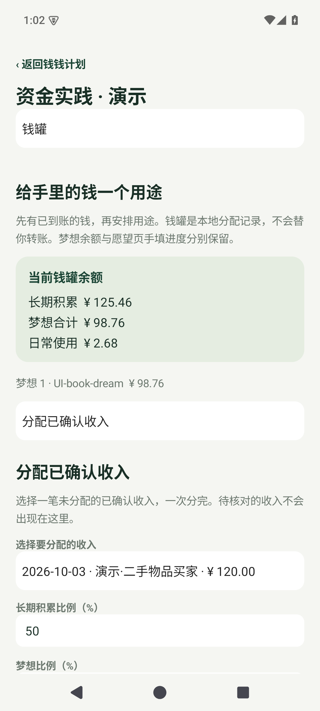
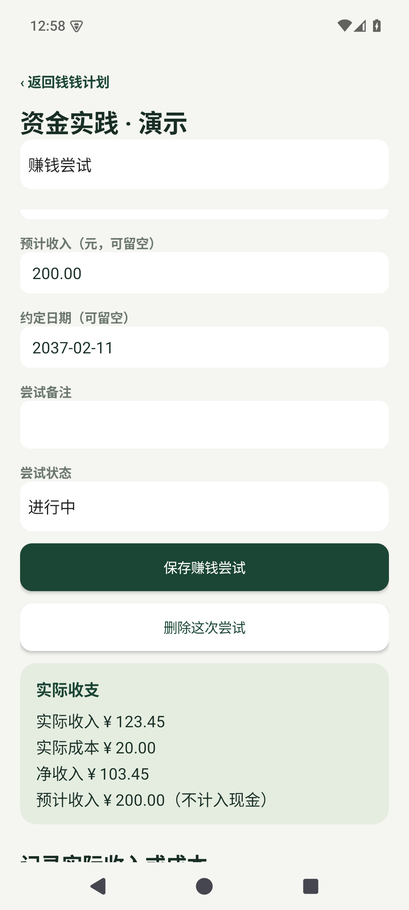

# 钱钱计划 · Tallybook

根据《小狗钱钱》两册中的方法制作的本地 Android 财务与行动练习工具，面向大学生。当前开发版 **0.5.0**：选梦想，给已收到的钱安排用途，尝试创造收入，记录做成的事，再回顾和调整。

Java 原生 Android 界面，支持 Android 8.0 起。数据保存在本机，应用没有联网权限。真实记录和虚构演示分开保存。

## 每天怎么用

| 页面 | 操作 |
| --- | --- |
| 今天 | 看当天准则与下一小步，写成功日记、开始 72 小时行动；安排钱罐、进入赚钱尝试，查看生活费与消费试算 |
| 账本 | 记录实际收入和支出，分类、备注、核对历史导入；查看汇总、删除误记的手动记录 |
| 梦想 | 写十个愿望及原因，选最多三个重点，关联自己的图片；分别查看梦想钱罐与手记进度 |
| 成长 | 成功日记、行动结果、七条准则实践、赚钱能力练习、离线学习试算和两册方法指南 |
| 复盘 | 最近七天收支、每周进展/障碍/下一步、每月回顾与讨论，以及资产和债务盘点 |

设置在右上角，提供单笔 JSON 导入、账本 CSV 导出和数据管理。旧版的单一存钱目标可从「梦想 → 原存钱目标」查看，也能复制到空的愿望位置。

## 钱罐与赚钱尝试

- **收入分配**：选择账本里已经确认的收入，按可调比例分给金鹅、一个梦想和日常。每笔收入只分配一次，整数分守恒。50/40/10 是书中人物的例子，可以调整。
- **已有的钱**：期初资金单独登记，不生成一笔虚假的收入。金鹅、日常与十个梦想钱罐之间可调拨，不重复记收支。
- **实际花费**：选择已记入账本的支出，从对应钱罐核销一次；不会再写一笔支出。撤销分配或调拨前会检查后续余额，避免出现负数。
- **赚钱尝试**：写明谁有需要、能提供什么、拥有的能力和资源，以及预期金额与日期。实际到账和成本才写进账本，同时显示实收、成本和净收入。预计收入不进入余额。
- **资产与债务**：登记现金、其他资产和债务，记录到期日、最低还款额及备注；区分现金和净资产。这是手动盘点，不会生成收支或自动改变钱罐。

已关联钱罐或项目的账本记录受保护。需要修改时从相应的钱罐历史或项目流水处理，避免账本与用途余额脱节。

以下是 0.5.0 模拟器实拍，全部使用虚构演示数据：

<p></p>

生活费单独按下式计算：

> 本期可用 = 期初可用余额 + 本期已确认收入 − 本期已确认支出 − 尚未支付的固定预留 − 储蓄预留

只统计截至今天的本期记录。钱罐安排、资产盘点、手填梦想进度和生活费预留分别表达不同信息，不能直接相加。已包含在期初的钱不要重复记为收入；开销已经入账后，应调减相应预留。

## 与书中方法的对应

成功日记从具体事实出发，允许少量起步、补记和修改，也可写明原因与用到的能力。72 小时用于尽快完成一个足够小的行动；每日准则按星期循环，分别记录理解和经历。周复盘中的下一步可以带入新的行动草稿，月复盘保存对当月收支、目标、行动和学习的文字回顾。

学习试算包含复利、定期追加、通胀后的购买力、72 法则近似、集中与分散的风险场景，以及书中消费债务安排的示例。输入与假设清楚展示，结果不进入账本。资产增长、学习效果和行为改变都需要实际实践，工程测试不能证明这些结果。

方法指南包含两册的 43 个简短入口与章节来源；完整方法梳理及后续范围见 [产品设计](docs/BOOK_PRODUCT_PLAN.md)。这是原创的软件实现与简短转述，原书全文和插图不进入仓库。

## 电脑预览与手机运行

Windows 双击根目录 **`预览小账本.cmd`**，运行真实 APK。首次需要等待安卓模拟器启动；修改源码后运行 `scripts/preview.ps1 -Rebuild`。预览设备 `tallybook_preview` 保留试用数据，与可丢弃测试设备 `tallybook_api35` 分开。

手机开启 USB 调试，连接后第一次明确选择实验手机：

```powershell
.\scripts\run-device.ps1 -List
.\scripts\run-device.ps1 -Serial 手机的设备序列号 -Remember
```

之后双击 **`手机运行小账本.cmd`** 即可构建、覆盖更新并启动。`scripts/run-device.ps1 -Watch` 可在源码保存后自动更新。脚本锁定所选手机，不操作副屏平板、不卸载应用或清空数据；具体说明见 [开发文档](docs/DEVELOPMENT.md)。

运行 `scripts/build.ps1` 生成 `artifacts/tallybook-0.5.0-debug.apk`，历史 APK 保留。CI 产物见 [GitHub Actions](https://github.com/Southwall-Tester/tallybook/actions)，本地与 CI 的调试签名可能不同。安装、构建、模拟器和实机结果分别记录在 [验证记录](docs/VALIDATION.md)。

## 历史实验

0.5.0 按用户决定停止微信直接查询开发，移除应用查询入口、USB 查询助手、Hook 与接收 Provider。旧的本机账本数据继续可读。当前保留的文件功能仅支持已适配的单笔 JSON，不是微信官方 CSV/XLSX 导入器。

- 屏幕读取/OCR 保存版：[screen-ocr-v0.3.0](https://github.com/Southwall-Tester/tallybook/tree/screen-ocr-v0.3.0)。
- 微信查询保存版：[wechat-query-v0.4.0](https://github.com/Southwall-Tester/tallybook/tree/wechat-query-v0.4.0)。

当前应用不读取微信、屏幕或通知，也不进行后台账单同步。历史研究与验证过程保留在 Git 中。

## 开发

```powershell
.\scripts\bootstrap.ps1
.\scripts\build.ps1
.\scripts\start-emulator.ps1
.\scripts\test-emulator.ps1
python -X utf8 scripts/book-ui-smoke.py
python -X utf8 scripts/finance-ui-smoke.py
python -X utf8 scripts/book-image-ui-smoke.py
```

测试只在指定的可丢弃模拟器使用虚构数据，UI 脚本依次运行。工具链为 JDK 21、Gradle wrapper 8.11.1、AGP 8.9.2、SDK 35；本地工具、APK、账单、私人图片和密钥均不提交。完整功能经检查后提交和推送，较大改动使用功能分支与 PR。

按 GPL-3.0 发布，来源与依赖见 [THIRD_PARTY_NOTICES.md](THIRD_PARTY_NOTICES.md)。
